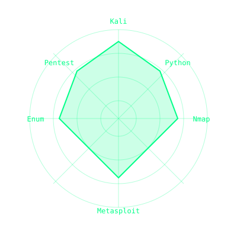

<!-- ================================== -->
<!-- README Cyber Profile -->
<!-- Estilo Cyberpunk / Dashboard / SVG Animado -->
<!-- ================================== -->

# 🧠 Cybersecurity Enthusiast

> 🚀 Estudante de Cibersegurança | Pentest | Redes | Vulnerabilidades  
> 💻 Ambiente: Kali Linux Lab | VS Code | Android Studio  
> 🎯 Objetivo: Primeiro emprego em Cybersecurity  

---

## 🧰 Tecnologias & Ferramentas

<!-- Linguagens -->

  

<!-- Ferramentas -->

  

<!-- IDEs -->

  

<!-- Sistemas -->

---

## 🧪 Laboratório & Estudos

| 🔐 Intrusão | 🌐 Redes | 📡 Pacotes | 🔎 Enumeração | 💣 Ataques |
|------------|--------|-----------|--------------|-----------|
| Metasploitable / VMs | Portas abertas | Wireshark / tcpdump | Enum4linux | SMB / FTP |

---

## 📌 Projetos em Destaque

- **Automação SMB e FTP** – scripts de brute force com logs e análise  
- **Enumeração de rede** – Nmap + Enum4linux  
- **Análise de pacotes** – tráfego real e credenciais em texto claro  
- **Pentest em Metasploitable 2** – execução completa documentada  

---

## 📚 Cursos & Certificações

- **Cisco** – Introdução à Cibersegurança – ✅ Concluído  
- **Dio** – Cibersegurança – 🔄 Em andamento  
- **Cisco** – Ethical Hacker – 🔄 Em andamento  
- **HackTheBox** – Junior Cybersecurity Analyst – 🔄 Em andamento  

---

## 📊 Skills Cyberpunk (Radar)

---

## 📫 Contato

📧 [wells.f1993@gmail.com](mailto:wells.f1993@gmail.com)

---

## ⚡ Status

- 🔐 Evoluindo em **Pentest**  
- 🌐 Foco em **Redes**  
- 🎯 Preparação para **CTFs e desafios reais**

---

## 🧠 Filosofia

> «Segurança não é um produto, é um processo.» 🔐

---

⭐ Se curtir meus projetos, deixe uma **estrela**!